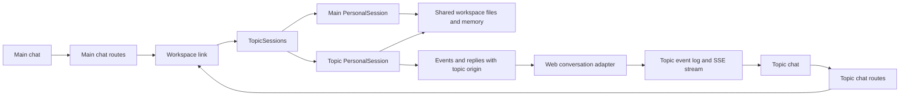

# Topic threads

Main is the owner's default conversation. Each topic has a separate agent session, transcript, message queue, and delivery outbox.
Topics use the same workspace files, tools, model configuration, and memory as Main.

## Ownership

| Component                          | Responsibility                                                                                 |
| ---------------------------------- | ---------------------------------------------------------------------------------------------- |
| `src/workspace/topicSessions.ts`   | Create sessions, restore state, route commands, and archive topics.                            |
| `src/workspace/personalSession.ts` | Handle one conversation, including approvals, streaming, memory upkeep, and delivery retries.  |
| `src/surfaces/web/threadRoutes.ts` | Store topic metadata, serve topic APIs, route surface calls, and report closed topics to Main. |
| `src/surfaces/web/chatLog.ts`      | Store and replay events for one conversation.                                                  |
| `web/src/lib/features/threads/`    | Display the topic list, briefs, conversations, and close/reopen controls.                      |

## Persistence

The bot stores metadata in `web_threads`. Each event and inbound message has a `conversation_id`.
Existing rows belong to `main`. Event IDs remain globally unique, while history and SSE replay filter by conversation.
Idempotency keys belong to one conversation. A client message ID cannot move between conversations.

The workspace stores the topic catalog in `WORKSPACE_STATE_DIR/topics.json`.
Each topic stores its state, received message IDs, and outbox under `WORKSPACE_STATE_DIR/topics/<id>/`.
Pi transcripts live under `PI_CODING_AGENT_DIR/topics/<id>/`.
Main keeps its existing paths.

## Routing

Topic origins use `{ surface: "web", conversationId: "<topic-id>" }`.
The workspace routes messages by origin. Stop, reset, and compaction requests also include the origin.
Each topic uses the existing chat API through `/api/threads/<id>/chat/`.
The browser creates a separate hub for that stream and reuses the existing retry, draft, and photo code.

Progress and approval handles retain their conversation. A new turn only retires stale progress in the same conversation.
Delegation captures the parent turn and origin. Background results return to the session that started them.
Push notifications open the correct topic.

## Lifecycle

A new topic receives the selected Main reply and its title as a brief.
A topic created from the Chats list starts with its title alone.
The brief is stored before the first user message and restored after a workspace restart.

Closing requires an idle topic with no pending delegation results.
The workspace saves memory before archiving. It keeps the session and transcript for reopening.
The bot stores a report in Main and sends a context-only report to Main's agent session.
Failed context delivery remains on disk and retries after reconnection or periodic maintenance.
Repeated close requests return the stored report.

Up to eight topics can remain active. Topics archive after seven idle days.
Pending questions and approvals prevent automatic archiving. Offline archive attempts retry later.

## Shared memory

Conversations have separate context windows. Shared files contain facts and decisions that must carry between conversations.
The existing memory guards and serialized Git commits apply to every topic.
Concurrent agents still operate on the same workspace. Topic separation does not provide file isolation or transactional edits.

The initial implementation does not attribute individual memory edits to topics.
The memory audit and undo screens remain separate features.

## Enable and test

After both bot and workspace support topics, add `threads` to the bot's `WEB_FEATURES` configuration.
The feature stays hidden without this flag.

Run the normal repository and web checks. Run `bun run e2e:system threads.e2e.ts` for the real topic flow.
The system flows cover branching, streaming, history isolation, workspace restart, closing, reopening, independent Stop, and topic approvals.
