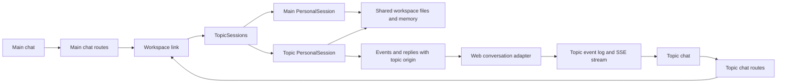

# Topic threads

Main is the owner's general-purpose hub. A thread is an ongoing conversation for a topic or workstream, returned to across visits. Each topic has a separate agent session, transcript, message queue, and delivery outbox.
Topics use the same workspace files, tools, model configuration, and memory as Main.

## Ownership

| Component                          | Responsibility                                                                                |
| ---------------------------------- | --------------------------------------------------------------------------------------------- |
| `src/workspace/topicSessions.ts`   | Create sessions, restore state, route commands, and archive topics.                           |
| `src/workspace/personalSession.ts` | Handle one conversation, including approvals, streaming, memory upkeep, and delivery retries. |
| `src/surfaces/web/threadRoutes.ts` | Store topic metadata, serve topic APIs, route surface calls, and archive inactive topics.     |
| `src/surfaces/web/chatLog.ts`      | Store and replay events for one conversation.                                                 |
| `web/src/lib/features/threads/`    | Display the topic list, briefs, conversations, and archive controls.                          |

## Persistence

The bot stores metadata in `web_threads`. Each event and inbound message has a `conversation_id`.
Existing rows belong to `main`. Event IDs remain globally unique, while history and SSE replay filter by conversation.
Idempotency keys belong to one conversation. A client message ID cannot move between conversations.

The workspace stores the topic catalog in `WORKSPACE_STATE_DIR/topics.json`.
Each topic stores its state, received message IDs, and outbox under `WORKSPACE_STATE_DIR/topics/<id>/`.
Pi transcripts live under `PI_CODING_AGENT_DIR/topics/<id>/`.
Main keeps its existing paths.

## Routing

Topic origins use `{ surface: "web", conversationId: "<topic-id>" }`.
The workspace routes messages by origin. Stop, reset, and compaction requests also include the origin.
Each topic uses the existing chat API through `/api/threads/<id>/chat/`.
The browser creates a separate hub for that stream and reuses the existing retry, draft, and photo code.

Progress and approval handles retain their conversation. A new turn only retires stale progress in the same conversation.
Delegation captures the parent turn and origin. Background results return to the session that started them.
Push notifications open the correct topic.

## Lifecycle

A new topic receives the selected Main reply and its title as a brief.
A topic created from the Threads list starts with its title alone.
The brief is stored before the first user message and restored after a workspace restart.

Archiving only changes organization. Archived threads appear in a visible section below current threads, keep their IDs and transcripts, and resume when the user sends a message. Archiving stays in the conversation; it does not redirect to Main or generate a report.

Topics move into Archived after seven idle days. Pending questions, approvals, active turns, and background delegation prevent archiving. Offline attempts retry at the next maintenance pass. There is no thread-count limit or expiry. The workspace saves memory before retiring an idle archived session; reopening restores its persisted transcript.

Finite delegated tasks return a result to the conversation that spawned them. Ordinary topic conversations do not report back to Main. Main receives a metadata-only index at the start of each turn: ID, title, archive status, last activity when present in the bounded run index, and a thread link. No transcript or result summary enters Main automatically. `list_threads` refreshes that index; `get_thread_history` retrieves a selected topic's recent user/assistant steps or stored run summaries on demand, with a cursor for older runs and truncation indicators. Archived threads can be read without resuming them.

Existing run records identify topics through their `topic:<id>` agent name when they predate the `conversationId` field. Topic runs classify as chat turns; delegated child runs stay separate. Transcript reads use the existing confined run reader and the selected run's time window.

## Existing data and navigation

The existing `/chat` and `/chats/<id>` URLs remain stable, labeled Main and Threads. Existing IDs, transcripts, brief context, drafts, and archive metadata remain unchanged. Old closing reports remain historical Main messages; pending report delivery is no longer retried. Both manually and automatically archived threads remain visible and directly resumable with the same IDs. The former eight-active-thread cap is removed in both bot and workspace; existing threads need no migration or deletion to create or resume more conversations. No database or topic-catalog rewrite is required.

New completed turns retain tool lines, assistant activity text, and text offsets in their existing durable `turn_final` event. History can restore individual inline tools in the same order shown during streaming. Older events without these optional fields keep their original reply and approval history; missing tool activity is not reconstructed or invented. The event schema remains backward compatible, with no historical rewrite required.

Projects are optional grouping and shared-context containers, not mandatory conversation folders. This change does not convert existing task project records or repository clones into thread containers, and does not add project navigation.

## Shared memory

Conversations have separate context windows. Shared files contain facts and decisions that must carry between conversations.
The existing memory guards and serialized Git commits apply to every topic.
Concurrent agents still operate on the same workspace. Topic separation does not provide file isolation or transactional edits.

The initial implementation does not attribute individual memory edits to topics.
The memory audit and undo screens remain separate features.

## Test

Topic conversations are available automatically when the web gateway is enabled.

Run the normal repository and web checks. Run `bun run e2e:system threads.e2e.ts` for the real topic flow.
The system flows cover branching, streaming, history isolation, workspace restart, archiving, resuming, independent Stop, and topic approvals.
